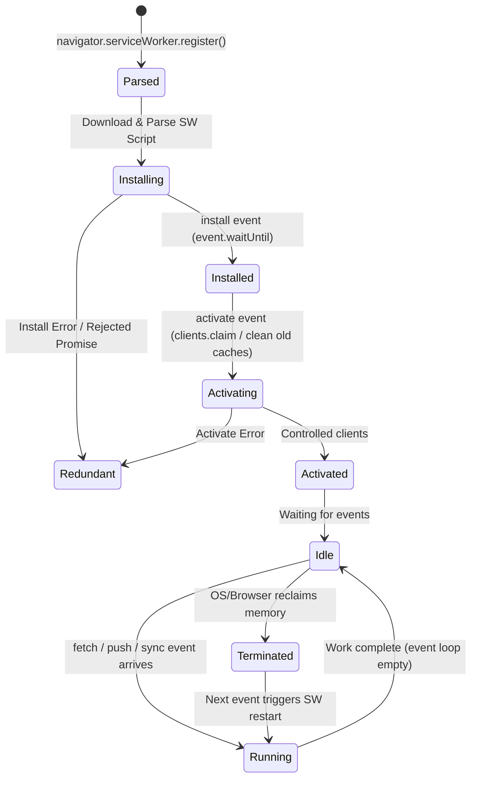

# Web Workers & Service Workers: Deep Architectural Cheatsheet

A comprehensive, production-grade guide covering **Web Workers (Dedicated & Shared)**, **Service Workers**, **Worklets**, execution models, memory architectures, caching strategies, and staff-level performance trade-offs.

---

## 1. Worker Taxonomy & Executive Comparison Matrix

The browser provides distinct background execution threads, each designed with different scopes, lifecycles, and capabilities:

```
                                  BROWSER WORKERS
                                         │
         ┌───────────────────────────────┼───────────────────────────────┐
         ▼                               ▼                               ▼
    Web Workers                   Service Workers                    Worklets
 (Heavy Compute)               (Network/Offline/Sync)            (Low-Latency Pipeline)
  ├── Dedicated Worker          └── Single origin-wide            ├── AudioWorklet
  └── Shared Worker                 network proxy                 ├── PaintWorklet
                                                                  └── AnimationWorklet
```

### Deep Comparison Matrix

| Feature / Dimension        | Dedicated Web Worker                                    | Shared Worker                                         | Service Worker                                                | Audio/Paint Worklet                                         |
| :------------------------- | :------------------------------------------------------ | :---------------------------------------------------- | :------------------------------------------------------------ | :---------------------------------------------------------- |
| **Primary Purpose**        | Offload CPU-heavy computation from main thread          | Share state/connections across multiple tabs/windows  | Programmable network proxy, caching, offline, background sync | Ultra-low latency audio rendering or custom CSS paint hooks |
| **Creator / Owner**        | Single script in a single tab/window                    | Multiple tabs, iframes, or windows on the same origin | Entire origin scope (controls multiple clients/tabs)          | Rendering / Audio engine thread pipeline                    |
| **Lifecycle**              | Bound to creator page lifetime (or until `terminate()`) | Alive as long as ≥1 connected tab/port is open        | Event-driven, ephemeral (woken up on event, killed when idle) | Bound to page lifecycle and rendering frame pipeline        |
| **DOM Access**             | ❌ No direct DOM access                                 | ❌ No direct DOM access                               | ❌ No direct DOM access                                       | ❌ No direct DOM access                                     |
| **Network Interception**   | ❌ No (`fetch` behaves normally)                        | ❌ No (`fetch` behaves normally)                      | ✅ **Yes** (Intercepts all origin HTTP/HTTPS fetches)         | ❌ No network access                                        |
| **Communication**          | `postMessage` / `onmessage`                             | `port.postMessage` / `port.onmessage`                 | `postMessage`, `clients.matchAll()`, `BroadcastChannel`       | Custom parameter descriptors & thread-safe message queues   |
| **Available Storage**      | IndexedDB, Cache API                                    | IndexedDB, Cache API                                  | IndexedDB, Cache API                                          | ❌ None (stateless / tight real-time constraints)           |
| **UI Freezing Prevention** | ✅ Completely offloads JS event loop                    | ✅ Completely offloads JS event loop                  | ✅ Handles background requests without main thread stalls     | ✅ Runs outside JS garbage collection pauses                |
| **Required Protocol**      | HTTP / HTTPS / localhost                                | HTTP / HTTPS / localhost                              | **HTTPS strictly** (or localhost for dev)                     | HTTPS strictly (or localhost)                               |

---

## 2. Web Workers (Dedicated & Shared)

### 2.1 What Problem Web Workers Solve

JavaScript on the browser main thread is **single-threaded**. Long-running tasks (>50ms) block:

1. User input event handling (causing high **INP** - Interaction to Next Paint).
2. Frame rendering pipeline (causing dropped frames / UI jank at 60Hz/120Hz).
3. Browser UI animations and CSS transitions.

Web Workers run JavaScript in an **isolated OS-level thread** with its own execution context and event loop (`DedicatedWorkerGlobalScope`).

---

### 2.2 When to Use vs. When NOT to Use

```
                            WORKER SUITABILITY DECISION
                                         │
                   Does task take > 16-50ms CPU time?
                                   ├── No ──► Keep on Main Thread (worker overhead is wasteful)
                                   └── Yes
                                         │
                      Does task require direct DOM access?
                                   ├── Yes ─► Main Thread (use requestAnimationFrame / scheduling)
                                   └── No
                                         │
                  Is serialization overhead < computation time?
                                   ├── No ──► Main Thread (structured clone cost dominates)
                                   └── Yes ─► ✅ DELEGATE TO WEB WORKER
```

#### ✅ Best Use Cases

- **Heavy Data Processing**: Parsing large CSV/JSON (>5MB), Excel sheets, AST generation.
- **Cryptography & Compression**: RSA key generation, hashing (SHA-256/argon2), gzip/brotli decompression, image decoding.
- **Media Manipulation**: Image filtering via `OffscreenCanvas`, canvas pixel manipulation, video frame processing.
- **WebAssembly Modules**: Running heavy C++/Rust compiled engines (physics, CAD, ML inference, SQLite in-browser).
- **Complex Algorithms**: Pathfinding (A\*), diffing large trees/datasets, syntax highlighters.

#### ❌ Anti-Patterns & When NOT to Use

- **Simple / Micro-tasks**: Sorting 50 items. The serialization cost of `postMessage` (1–5ms) exceeds execution time.
- **DOM Mutations**: Workers cannot touch `document.getElementById`, `window.history`, etc.
- **Frequent Synchronous Sync**: Constantly pinging main-thread state creates message bus congestion.

---

### 2.3 Web Worker Implementation Patterns

#### Standard ESM Module Worker (Vite / Webpack 5 / Modern Browsers)

```javascript
// main.js
const worker = new Worker(new URL('./compute.worker.js', import.meta.url), {
  type: 'module',
});

worker.postMessage({ type: 'PROCESS_DATA', payload: largeDataset });

worker.onmessage = (event) => {
  const { type, result } = event.data;
  if (type === 'PROCESS_COMPLETE') {
    updateUI(result);
  }
};

worker.onerror = (error) => {
  console.error('Worker error:', error.message, error.filename, error.lineno);
};

// Cleanup when unmounting or terminating
// worker.terminate();
```

```javascript
// compute.worker.js
self.onmessage = (event) => {
  const { type, payload } = event.data;
  if (type === 'PROCESS_DATA') {
    const processed = heavyComputation(payload);
    self.postMessage({ type: 'PROCESS_COMPLETE', result: processed });
  }
};

function heavyComputation(data) {
  // Heavy CPU work...
  return data.map((item) => item * 2);
}
```

#### Inline Blob Worker (Zero External Files)

```javascript
function createInlineWorker(workerFn) {
  const code = `(${workerFn.toString()})();`;
  const blob = new Blob([code], { type: 'application/javascript' });
  const workerUrl = URL.createObjectURL(blob);
  const worker = new Worker(workerUrl);
  URL.revokeObjectURL(workerUrl); // Cleanup memory
  return worker;
}

const worker = createInlineWorker(() => {
  self.onmessage = (e) => {
    self.postMessage(e.data.toUpperCase());
  };
});
```

---

### 2.4 Worker Memory & Data Passing Models

Data passing between main thread and workers follows three distinct architectural patterns:

```
1. STRUCTURED CLONE (Deep Copy)
Main Thread Heap [ Data A ] ──── Deep Copy (Serialization) ────► Worker Heap [ Data A' ]
(Both threads retain independent copies. High memory & CPU clone cost for large objects)

2. TRANSFERABLE OBJECTS (Zero-Copy Transfer)
Main Thread Heap [ ArrayBuffer ] ── Ownership Transferred ────► Worker Heap [ ArrayBuffer ]
(Original thread's buffer is NEUTERED / detached: byteLength becomes 0. Instantaneous O(1))

3. SHARED MEMORY (SharedArrayBuffer + Atomics)
                    ┌───────────────────────────────┐
                    │       SharedArrayBuffer       │
                    └───────┬───────────────┬───────┘
                            │               │
                            ▼               ▼
                    Main Thread Heap   Worker Thread Heap
(Both access same physical RAM. Requires Atomics.wait / Atomics.notify to prevent race conditions)
```

#### A. Transferable Objects (Zero-Copy Transfer)

```javascript
// Main thread: Transferring an ArrayBuffer
const buffer = new ArrayBuffer(64 * 1024 * 1024); // 64 MB
const u8View = new Uint8Array(buffer);
u8View[0] = 42;

console.log(buffer.byteLength); // 67108864 (64 MB)

// Pass buffer in 2nd parameter (transfer list)
worker.postMessage({ type: 'PROCESS_RAW', buffer }, [buffer]);

console.log(buffer.byteLength); // 0 (Neutered! Memory ownership belongs to worker now)
```

#### Supported Transferable Types

- `ArrayBuffer`
- `MessagePort`
- `ImageBitmap`
- `OffscreenCanvas`
- `ReadableStream` / `WritableStream` / `TransformStream`
- `AudioData` / `VideoFrame` (WebCodecs)

#### B. SharedArrayBuffer & Atomics (Shared Memory Multithreading)

> [!IMPORTANT]
> **Security Requirement (Spectre Mitigation):** `SharedArrayBuffer` requires Cross-Origin Isolation headers on the server:
>
> ```http
> Cross-Origin-Opener-Policy: same-origin
> Cross-Origin-Embedder-Policy: require-corp
> ```

```javascript
// main.js
const sharedBuffer = new SharedArrayBuffer(4); // 4 bytes for 1 Int32
const sharedInt32 = new Int32Array(sharedBuffer);

worker.postMessage({ type: 'INIT_SHARED', sharedBuffer });

// Wait for worker to signal change
setTimeout(() => {
  console.log('Value updated by worker:', Atomics.load(sharedInt32, 0));
}, 100);
```

```javascript
// worker.js
self.onmessage = (e) => {
  if (e.data.type === 'INIT_SHARED') {
    const shared = new Int32Array(e.data.sharedBuffer);
    Atomics.store(shared, 0, 999); // Thread-safe atomic write
    Atomics.notify(shared, 0, 1); // Wake up 1 waiting thread
  }
};
```

---

### 2.5 Shared Workers

A `SharedWorker` is accessible by **multiple browser tabs, windows, or iframes** running on the exact same origin.

```
 Tab 1 (Origin A) ─── Port 1 ───┐
                                 │
 Tab 2 (Origin A) ─── Port 2 ────┼───► [ SharedWorkerGlobalScope ] (Single Shared Thread)
                                 │
 Tab 3 (Origin A) ─── Port 3 ───┘
```

#### Implementation Example

```javascript
// tab.js
const sharedWorker = new SharedWorker(new URL('./shared.worker.js', import.meta.url));

// Explicit port initialization
sharedWorker.port.start();

sharedWorker.port.postMessage({ type: 'SUBSCRIBE_TICKER', symbol: 'BTC' });

sharedWorker.port.onmessage = (e) => {
  console.log('Update from shared worker:', e.data);
};
```

```javascript
// shared.worker.js
const connectedPorts = new Set();
let sharedSocket = null;

self.onconnect = (event) => {
  const port = event.ports[0];
  connectedPorts.add(port);
  port.start();

  port.onmessage = (e) => {
    if (e.data.type === 'SUBSCRIBE_TICKER') {
      broadcast({ ticker: e.data.symbol, price: 65000 });
    }
  };

  port.onclose = () => {
    connectedPorts.delete(port);
  };
};

function broadcast(data) {
  for (const port of connectedPorts) {
    port.postMessage(data);
  }
}
```

---

## 3. Service Workers (Network Proxy & Offline Engine)

### 3.1 What Problem Service Workers Solve

1. **Network Fragility & Offline**: Web apps traditionally fail when network drops ("Downasaur"). Service Workers enable 100% offline functionality.
2. **Deterministic Caching**: Complete control over HTTP request/response caching at the client boundary.
3. **Background Services**: Push notifications, background data synchronization, periodic fetching even when the tab is closed.
4. **Performance Acceleration**: Instant page loads via Pre-cached App Shells & Stale-While-Revalidate strategies.

---

### 3.2 Service Worker Lifecycle & State Machine



#### Registration & Immediate Control Pattern

```javascript
// main.js - Registering the Service Worker
if ('serviceWorker' in navigator) {
  window.addEventListener('load', async () => {
    try {
      const registration = await navigator.serviceWorker.register('/sw.js', {
        scope: '/', // Controls all routes under /
      });
      console.log('SW Registered with scope:', registration.scope);
    } catch (err) {
      console.error('SW Registration failed:', err);
    }
  });
}
```

```javascript
// sw.js - Install, Skip Waiting & Activate
const CACHE_NAME = 'app-v2.1.0';
const STATIC_ASSETS = ['/', '/index.html', '/styles/main.css', '/scripts/app.js', '/offline.html'];

// 1. INSTALL PHASE: Precache core static assets
self.addEventListener('install', (event) => {
  event.waitUntil(
    caches
      .open(CACHE_NAME)
      .then((cache) => {
        return cache.addAll(STATIC_ASSETS);
      })
      .then(() => {
        return self.skipWaiting(); // Force active state, bypass waiting phase
      }),
  );
});

// 2. ACTIVATE PHASE: Purge stale/old cache buckets
self.addEventListener('activate', (event) => {
  event.waitUntil(
    caches
      .keys()
      .then((keys) => {
        return Promise.all(
          keys.map((key) => {
            if (key !== CACHE_NAME) {
              console.log('Deleting obsolete cache:', key);
              return caches.delete(key);
            }
          }),
        );
      })
      .then(() => {
        return self.clients.claim(); // Take immediate control of uncontrolled open tabs
      }),
  );
});
```

---

### 3.3 Core Caching Strategies (Production Code Recipes)

```
                            CACHING STRATEGIES MAP
                                      │
        ┌─────────────────────────────┼─────────────────────────────┐
        ▼                             ▼                             ▼
   Cache First                  Network First             Stale-While-Revalidate
(Hashed JS, CSS,            (HTML, Real-time APIs,         (Avatars, News Feeds,
 Fonts, Images)               User Account Data)             Semi-static content)
```

#### 1. Cache First (Falling Back to Network)

> **Best for:** Hashed static assets (`app.8f3a1b.js`, `styles.9c2d.css`, fonts, immutable media).

```javascript
self.addEventListener('fetch', (event) => {
  if (event.request.destination === 'image' || event.request.destination === 'font') {
    event.respondWith(
      caches.match(event.request).then((cachedResponse) => {
        if (cachedResponse) return cachedResponse;

        return fetch(event.request).then((networkResponse) => {
          if (!networkResponse || networkResponse.status !== 200) return networkResponse;
          const responseToCache = networkResponse.clone();
          caches.open(CACHE_NAME).then((cache) => cache.put(event.request, responseToCache));
          return networkResponse;
        });
      }),
    );
  }
});
```

#### 2. Network First (Falling Back to Cache)

> **Best for:** HTML documents and fresh API responses where stale data is unacceptable.

```javascript
self.addEventListener('fetch', (event) => {
  if (event.request.mode === 'navigate' || event.request.url.includes('/api/live/')) {
    event.respondWith(
      fetch(event.request)
        .then((networkResponse) => {
          const responseClone = networkResponse.clone();
          caches.open(CACHE_NAME).then((cache) => cache.put(event.request, responseClone));
          return networkResponse;
        })
        .catch(() => {
          return caches.match(event.request).then((cached) => {
            return cached || caches.match('/offline.html');
          });
        }),
    );
  }
});
```

#### 3. Stale While Revalidate (SWR)

> **Best for:** Frequently updated content where speed is priority (avatars, product lists, home feed).

```javascript
self.addEventListener('fetch', (event) => {
  if (event.request.url.includes('/api/feed')) {
    event.respondWith(
      caches.open(CACHE_NAME).then((cache) => {
        return cache.match(event.request).then((cachedResponse) => {
          const fetchPromise = fetch(event.request).then((networkResponse) => {
            cache.put(event.request, networkResponse.clone());
            return networkResponse;
          });
          // Return cached immediately if available, while network updates cache in background
          return cachedResponse || fetchPromise;
        });
      }),
    );
  }
});
```

---

### 3.4 Background Sync & Push Notifications

```
                              PUSH NOTIFICATION FLOW
 Server (App Server)
      │
      ▼ Send Encrypted Payload via WebPush Protocol
 Push Service (Apple APNs / Google FCM / Mozilla Autopush)
      │
      ▼ Push Event Dispatched
 Service Worker (Background OS Wakeup) ──► event.waitUntil(self.registration.showNotification())
      │
      ▼ User Clicks Notification
 Main App Tab (Focus or openWindow)
```

#### Background Sync API

```javascript
// In main page: Register sync request when offline
async function submitOrder(orderData) {
  await saveToIndexedDB('outbox', orderData);
  const reg = await navigator.serviceWorker.ready;
  if ('sync' in reg) {
    await reg.sync.register('sync-pending-orders');
  } else {
    // Fallback for browsers without Background Sync support
    postDirectly(orderData);
  }
}

// In sw.js: Handle the background sync event
self.addEventListener('sync', (event) => {
  if (event.tag === 'sync-pending-orders') {
    event.waitUntil(flushPendingOrders());
  }
});

async function flushPendingOrders() {
  const pendingOrders = await getFromIndexedDB('outbox');
  for (const order of pendingOrders) {
    await fetch('/api/orders', {
      method: 'POST',
      body: JSON.stringify(order),
      headers: { 'Content-Type': 'application/json' },
    });
    await deleteFromIndexedDB('outbox', order.id);
  }
}
```

---

## 4. Worklets (AudioWorklet, PaintWorklet, AnimationWorklet)

Worklets are specialized, highly constrained, ultra-lightweight worker pipelines designed for **real-time operations** that cannot tolerate JavaScript garbage collection pauses.

| Worklet Type         | Pipeline Phase          | Purpose                                                                   |
| :------------------- | :---------------------- | :------------------------------------------------------------------------ |
| **AudioWorklet**     | Web Audio DSP Engine    | Real-time audio synthesis, low-latency DSP filtering                      |
| **PaintWorklet**     | CSS Houdini Paint Stage | Programmatic background/border image rendering directly in paint pipeline |
| **AnimationWorklet** | Compositor Thread       | Smooth, jank-free animations synced directly with hardware VSync          |

---

## 5. Staff-Level Gotchas, Pitfalls & Anti-Patterns

### 1. The Service Worker Caching Loop Trap (Stale `sw.js`)

- **Problem**: If `sw.js` is cached with HTTP `Cache-Control: max-age=31536000`, the browser will not download updates to the service worker itself.
- **Fix**: Never cache `sw.js` via HTTP cache! Serve `sw.js` with:
  ```http
  Cache-Control: no-cache, no-store, must-revalidate
  ```
  _(Note: Modern browsers check for byte changes in `sw.js` at least every 24 hours regardless of HTTP headers, but serving with `no-cache` ensures instant updates)._

### 2. Scope & Directory Boundaries

- A Service Worker at `/app/sw.js` can only control URLs under `/app/*`.
- To control the whole origin (`/`), `sw.js` must be served from the root (`/sw.js`) or served with the `Service-Worker-Allowed: /` HTTP header.

### 3. Ephemeral In-Memory State in Service Workers

- ❌ **Anti-Pattern**: Storing global variables in `sw.js` (`let userToken = null;`).
- **Why**: The browser will terminate the Service Worker when idle (often after 30s). The next event spawns a fresh worker instance, wiping in-memory variables.
- **Fix**: Persist all SW state in **IndexedDB** or **Cache Storage**.

### 4. `postMessage` Memory Leaks

- Sending massive object trees via structured clone clones the entire object graph. If done inside a `requestAnimationFrame` loop (60fps), it triggers heavy Garbage Collection thrashing and frame drops.
- **Fix**: Use `Transferable` objects (`ArrayBuffer`, `ImageBitmap`) for high-frequency transmissions.

---

## 6. Architecture & System Flow Summary

```
┌─────────────────────────────────────────────────────────────────────────────────┐
│                                BROWSER RUNTIME                                  │
│                                                                                 │
│   ┌──────────────────────────────┐              ┌───────────────────────────┐   │
│   │         MAIN THREAD          │              │        WEB WORKER         │   │
│   │                              │ postMessage  │                           │   │
│   │  DOM Tree & User Events      ├─────────────►│  Heavy Calculations       │   │
│   │  React / Vue UI Renders      │ Transferable │  WASM Modules / Crypto    │   │
│   │  Microtasks / Macrotasks     │◄─────────────┤  Zero Main-Thread Latency │   │
│   └──────────────┬───────────────┘              └───────────────────────────┘   │
│                  │                                                              │
│                  │ window.fetch() / navigation                                  │
│                  ▼                                                              │
│   ┌─────────────────────────────────────────────────────────────────────────┐   │
│   │                             SERVICE WORKER                              │   │
│   │                                                                         │   │
│   │   Intercepts Fetch Events ──► Evaluates Cache Strategy                  │   │
│   │   Background Sync         ──► Background Push & Notifications           │   │
│   └──────────────┬──────────────────────────────┬───────────────────────────┘   │
│                  │                              │                               │
│                  ▼                              ▼                               │
│       ┌─────────────────────┐        ┌─────────────────────┐                    │
│       │    CACHE STORAGE    │        │      NETWORK        │                    │
│       │ (Static/HTML Cache) │        │   (Origin Server)   │                    │
│       └─────────────────────┘        └─────────────────────┘                    │
└─────────────────────────────────────────────────────────────────────────────────┘
```
