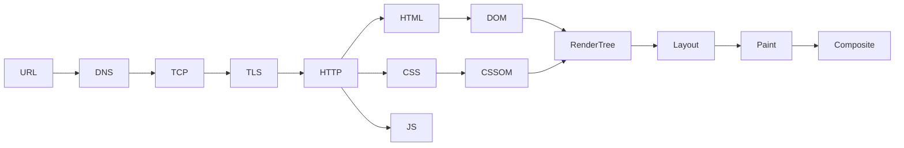
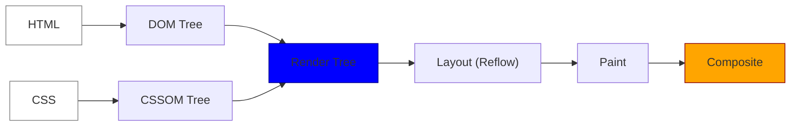

# How the Web Works: High-Level Reference

A curated, high-level map of the end-to-end web transaction and browser rendering pipelines. Use this reference for quick lookups on how data travels from a URL to screen pixels, and refer to **[How the Web Works: Deep-Dive (Web/web.md)](../Web/web.md)** for in-depth network layer specifications.

---

## 1. Web Touchpoints Flow

The complete 17-step sequential lifecycle of a web transaction:

```text
URL (User types domain into address bar)
 │
 ▼
DNS Lookup (Translate host domain name to numeric IP address)
 │
 ▼
TCP Connection (Establish a TCP 3-way handshake transport socket)
 │
 ▼
TLS Handshake (Negotiate secure symmetric cryptographic keys)
 │
 ▼
HTTP Request (Send GET request payload header structures)
 │
 ▼
Server Processing (Run controllers, verify cache, query databases)
 │
 ▼
TTFB (Time to First Byte - browser receives first response segment)
 │
 ▼
Response Download (Stream remaining HTML document packets)
 │
 ▼
DOM Tree Construction (Tokenize and parse HTML nodes in memory)
 │
 ▼
CSSOM Tree Construction (Parse stylesheet selector rules)
 │
 ▼
JavaScript Execution (Download and execute blocking/async scripts)
 │
 ▼
Render Tree Construction (Combine visible DOM elements with CSSOM styles)
 │
 ▼
Layout / Reflow (Compute geometry, coordinates, and box dimensions)
 │
 ▼
Paint (Rasterize element textures, colors, borders, and shadows)
 │
 ▼
Composite (Layer painted assets on GPU threads)
 │
 ▼
Screen/UI (Display final pixels on the hardware monitor)
```

---

## 2. Big Picture Architecture



---

## 3. Browser Pre-Checks Flow (Avoiding the Network)

Before any packets are sent over the network card, the browser executes local cache checks to serve assets instantaneously:


---

## 4. The Critical Rendering Path (CRP)

The sequence of steps the browser takes to translate HTML, CSS, and JavaScript into pixels on the screen:



---

## 5. Summary of High-Level Concepts

- **DNS Resolution**: Maps human-readable hostnames to network-routable IP addresses (utilizing recursive, root, TLD, and authoritative name servers).
- **TCP 3-Way Handshake**: A connection-oriented handshake (`SYN` -> `SYN-ACK` -> `ACK`) establishing reliable socket communication.
- **TLS Handshake (Security)**: The client and server agree on encryption versions, validate certificates, and derive symmetric keys (optimized to 1-RTT or 0-RTT in TLS 1.3).
- **DOM (Document Object Model)**: The parsed tree representation of raw HTML nodes in memory.
- **CSSOM (CSS Object Model)**: The parsed stylesheet tree mapping rule selectors to styling layout properties.
- **JavaScript Blocking**: Scripts without `async` or `defer` attributes block DOM parser generation because JS can mutate DOM structure.
- **Layout (Reflow)**: Calculating the exact width, height, and coordinates of elements relative to the viewport.
- **Paint**: Converting layout geometry nodes into physical pixels on the screen.
- **Composite**: Organizing painted layers on GPU memory layers to prevent reflowing the entire document during animations.

---

## 6. Deep-Dive Specification Index

To inspect detailed network payloads, latency optimization protocols, and browser specifications, view **[How the Web Works (Web/web.md)](../Web/web.md)**:

- **[Anatomy of a URL](../Web/web.md#10-url-anatomy-the-detailed-breakdown)**: Protocol, subdomain, domain, TLD, port, path, query parameters, and hash identifiers.
- **[DNS Hierarchy Flow](../Web/web.md#32-dns-lookup-flow)**: Recursive querying from local resolver to Root, TLD, and Authoritative Name Servers.
- **[TCP/TLS Connection Mechanics](../Web/web.md#41-tcp-3way-handshake-guaranteed-delivery)**: Details on SYN/ACK packets, TLS 1.3 handshakes, and 0-RTT session resumption.
- **[HTTP Method & Status Semantics](../Web/web.md#61-http-method-semantics)**: Idempotency rules, safe methods, caching properties, and REST constraints.
- **[HTML & CSS Parsing Pipelines](../Web/web.md#91-parsing-html)**: Details on tokenizers, CSSOM inheritance selectors, and JavaScript script attributes (`async` vs `defer`).
- **[Layout & Composite Internals](../Web/web.md#15-compositing-rasterization--vsync)**: Rendering engines, rasterization threads, GPU layers compilation, and VSync hardware interactions.
